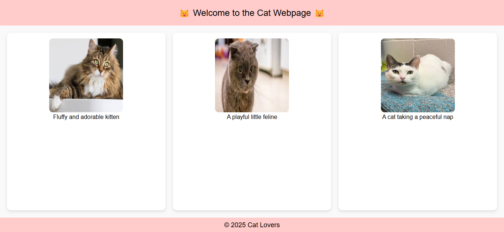

# flexbox-grid-layout

## 📌 Description
The Cat Webpage is a simple, responsive web page designed to showcase adorable cat images in a visually appealing layout. It uses a grid-based design to display images alongside descriptions. The page is styled using CSS to provide a clean and aesthetically pleasing experience.

## 🛠 Prerequisites
N/A

## 📋 Criteria
* Uses HTML for structuring the webpage
* Implements CSS Grid for responsive design
* Displays multiple cat images with captions
* Features a header, footer, and content area
* Includes shadows, rounded corners, and spacing for improved aesthetics

## 💻 Technologies Used
The application is built with the following technologies:
* HTML
* CSS
* CSS Grid 

## 🚀 Installation
No installation is required to use the app. It is hosted online and can be accessed via a web browser.

## 📚 Usage
1. Simply open the webpage in your browser to view adorable cat images.

## 🔗 Live Demo & Repository
Application can be viewed here: 
* [Live](https://yvonnesarah.github.io/flexbox-grid-layout/)

* [Repository](https://github.com/yvonnesarah/flexbox-grid-layout)

## 🖼 Screenshot
Below is a preview of Cats Flexbox Grid Layout:

## 👥 Credit
N/A

## 📜 License
This project is open-source. For licensing details, please refer to the LICENSE file in the repository.

## 📬 Contact
You can reach me at 📧 yvonneadedeji.sarah@gmail.com.
